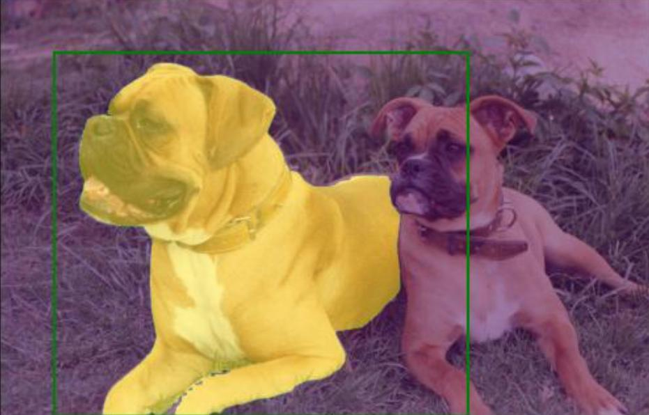
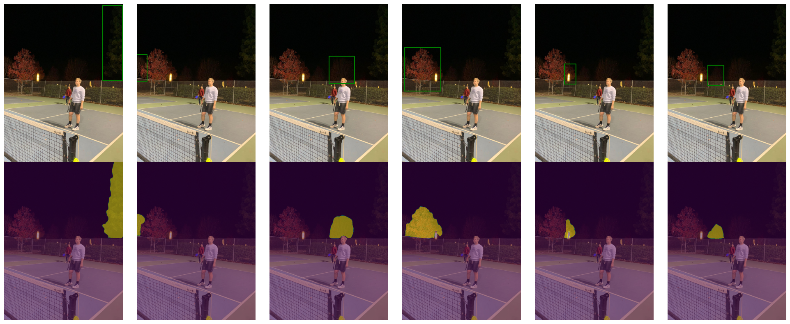
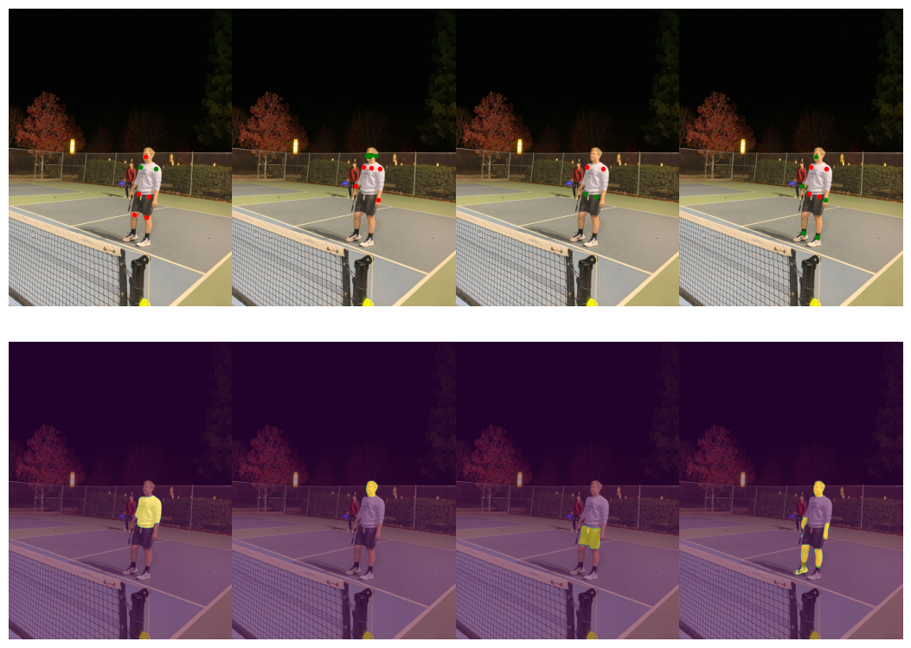

<h1 align="center"><span>NanoSAM</span></h1>

<p align="center"><a href="#usage"/>👍 Usage</a> - <a href="#performance"/>⏱️ Performance</a> - <a href="#setup">🛠️ Setup</a> - <a href="#examples">🤸 Examples</a> - <a href="#training">🏋️ Training</a> <br>- <a href="#evaluation">🧐 Evaluation</a> - <a href="#acknowledgement">👏 Acknowledgment</a> - <a href="#see-also">🔗 See also</a></p>

NanoSAM is a [Segment Anything (SAM)](https://github.com/facebookresearch/segment-anything) and [EfficientViT-SAM](https://github.com/mit-han-lab/efficientvit) model variant that is developed to target 🔥***CPU, mobile, and edge*** 🔥  deployment such as [NVIDIA Jetson Xavier Platforms](https://store.nvidia.com/en-us/jetson/store) with [NVIDIA TensorRT](https://developer.nvidia.com/tensorrt).  

**A demo of NanoSAM** running on **CPU** is open at [hugging face demo](https://huggingface.co/spaces/dragonSwing/nanosam). On our own i5-8265U CPU, it only takes around 0.3s. On the hugging face demo, the interface and inferior CPUs make it a little bit slower but still works fine.

<p align="center"></p>

> NanoSAM is trained by distilling the [EfficientViT-SAM-L0](https://github.com/mit-han-lab/efficientvit) image encoder
> on unlabeled images using 6% of SA-1B dataset.  For an introduction to knowledge distillation, we recommend checking out [this tutorial](https://github.com/NVIDIA-AI-IOT/jetson-intro-to-distillation).

<a id="usage"></a>

## 👍 Usage

Using NanoSAM from Python looks like this

```python3
from nanosam.utils.predictor import Predictor

image_encoder_cfg = {
    "path": "data/sam_hgv2_b4_ln_nonorm_image_encoder.onnx",
    "name": "OnnxModel",
    "provider": "cpu",
    "normalize_input": False,
}
mask_decoder_cfg = {
    "path": "data/efficientvit_l0_mask_decoder.onnx",
    "name": "OnnxModel",
    "provider": "cpu",
}
predictor = Predictor(encoder_cfg, decoder_cfg)

image = PIL.Image.open("assets/dogs.jpg")

predictor.set_image(image)

mask, _, _ = predictor.predict(np.array([[x, y]]), np.array([1]))
```

<details>
<summary>Notes</summary>
The point labels may be

| Point Label | Description               |
| :---------: | ------------------------- |
|      0      | Background point          |
|      1      | Foreground point          |
|      2      | Bounding box top-left     |
|      3      | Bounding box bottom-right |
</details>

> Follow the instructions below for how to build the engine files.

<a id="performance"></a>

## ⏱️ Performance

NanoSAM performance on edge devices.

<table style="border-top: solid 1px; border-left: solid 1px; border-right: solid 1px; border-bottom: solid 1px">
    <thead>
        <tr>
            <th rowspan=2 style="text-align: center; border-right: solid 1px">Model †</th>
            <th colspan=2 style="text-align: center; border-right: solid 1px">:stopwatch: CPU (ms)</th>
            <th colspan=2 style="text-align: center; border-right: solid 1px">:stopwatch: Jetson Xavier NX (ms)</th>
            <th colspan=2 style="text-align: center; border-right: solid 1px">:stopwatch: T4 (ms)</th>
            <th rowspan=2 style="text-align: center; border-right: solid 1px">Model Size</th>
            <th rowspan=2 style="text-align: center; border-right: solid 1px">Link</th>
        </tr>
        <tr>
            <th style="text-align: center; border-right: solid 1px">Image Encoder</th>
            <th style="text-align: center; border-right: solid 1px">Full Pipeline</th>
            <th style="text-align: center; border-right: solid 1px">Image Encoder</th>
            <th style="text-align: center; border-right: solid 1px">Full Pipeline</th>
            <th style="text-align: center; border-right: solid 1px">Image Encoder</th>
            <th style="text-align: center; border-right: solid 1px">Full Pipeline</th>
        </tr>
    </thead>
    <tbody>
        <tr>
            <td style="text-align: center; border-right: solid 1px">PPHGV2-SAM-B1</td>
            <td style="text-align: center; border-right: solid 1px">110ms</td>
            <td style="text-align: center; border-right: solid 1px">180ms</td>
            <td style="text-align: center; border-right: solid 1px">9.6ms</td>
            <td style="text-align: center; border-right: solid 1px">17ms</td>
            <td style="text-align: center; border-right: solid 1px">2.4ms</td>
            <td style="text-align: center; border-right: solid 1px">5.8ms</td>
            <td style="text-align: center; border-right: solid 1px">12.1MB</td>
            <td style="text-align: center; border-right: solid 1px"><a href="https://huggingface.co/dragonSwing/nanosam/resolve/main/sam_hgv2_b1_ln_nonorm_image_encoder.onnx">Link</a></td>
        </tr>
        <tr>
            <td style="text-align: center; border-right: solid 1px">PPHGV2-SAM-B2</td>
            <td style="text-align: center; border-right: solid 1px">200ms</td>
            <td style="text-align: center; border-right: solid 1px">270ms</td>
            <td style="text-align: center; border-right: solid 1px">12.4ms</td>
            <td style="text-align: center; border-right: solid 1px">19.8ms</td>
            <td style="text-align: center; border-right: solid 1px">3.2ms</td>
            <td style="text-align: center; border-right: solid 1px">6.4ms</td>
            <td style="text-align: center; border-right: solid 1px">28.1MB</td>
            <td style="text-align: center; border-right: solid 1px"><a href="https://huggingface.co/dragonSwing/nanosam/resolve/main/sam_hgv2_b4_ln_nonorm_image_encoder.onnx">Link</a></td>
        </tr>
        <tr>
            <td style="text-align: center; border-right: solid 1px">PPHGV2-SAM-B4</td>
            <td style="text-align: center; border-right: solid 1px">300ms</td>
            <td style="text-align: center; border-right: solid 1px">370ms</td>
            <td style="text-align: center; border-right: solid 1px">17.3ms</td>
            <td style="text-align: center; border-right: solid 1px">24.7ms</td>
            <td style="text-align: center; border-right: solid 1px">4.1ms</td>
            <td style="text-align: center; border-right: solid 1px">7.5ms</td>
            <td style="text-align: center; border-right: solid 1px">58.6MB</td>
            <td style="text-align: center; border-right: solid 1px"><a href="https://huggingface.co/dragonSwing/nanosam/resolve/main/sam_hgv2_b4_ln_nonorm_image_encoder.onnx">Link</a></td>
        </tr>
        <tr>
            <td style="text-align: center; border-right: solid 1px">NanoSAM (ResNet18)</td>
            <td style="text-align: center; border-right: solid 1px">500ms</td>
            <td style="text-align: center; border-right: solid 1px">570ms</td>
            <td style="text-align: center; border-right: solid 1px">22.4ms</td>
            <td style="text-align: center; border-right: solid 1px">29.8ms</td>
            <td style="text-align: center; border-right: solid 1px">5.8ms</td>
            <td style="text-align: center; border-right: solid 1px">9.2ms</td>
            <td style="text-align: center; border-right: solid 1px">60.4MB</td>
            <td style="text-align: center; border-right: solid 1px"><a href="https://drive.google.com/file/d/14-SsvoaTl-esC3JOzomHDnI9OGgdO2OR/view?usp=drive_link">Link</a></td>
        </tr>
        <tr>
            <td style="text-align: center; border-right: solid 1px">EfficientViT-SAM-L0</td>
            <td style="text-align: center; border-right: solid 1px">1s</td>
            <td style="text-align: center; border-right: solid 1px">1.07s</td>
            <td style="text-align: center; border-right: solid 1px">31.6ms</td>
            <td style="text-align: center; border-right: solid 1px">38ms</td>
            <td style="text-align: center; border-right: solid 1px">6ms</td>
            <td style="text-align: center; border-right: solid 1px">9.4ms</td>
            <td style="text-align: center; border-right: solid 1px">117.4MB</td>
            <td style="text-align: center; border-right: solid 1px"></td>
        </tr>
    </tbody>
</table>

<details>
<summary>Notes</summary>

- For CPU benchmark, latency/throughput is measured on Intel(R) Core(TM) i5-8265U CPU @ 1.60GHz using ONNX CPUExecutionProvider

- For GPU benchmark, latency/throughput is measured on NVIDIA Jetson Xavier NX, and NVIDIA T4 GPU with TensorRT, fp16. Data transfer time is included.

</details>

Zero-Shot Instance Segmentation on COCO2017 validation dataset

| Image Encoder   | mAP<sup>mask<br>50-95 | mIoU (all) | mIoU (large) | mIoU (medium) | mIoU (small) |
| --------------- | :-------------------: | :--------: | :----------: | :-----------: | :----------: |
| ResNet18        |           -           |    70.6    |     79.6     |     73.8      |     62.4     |
| MobileSAM       |           -           |    72.8    |     80.4     |     75.9      |     65.8     |
| PPHGV2-B1       |         41.2          |    75.6    |     81.2     |     77.4      |     70.8     |
| PPHGV2-B2       |         42.6          |    76.5    |     82.2     |     78.5      |     71.5     |
| PPHGV2-B4       |         44.0          |    77.3    |     83.0     |     79.7      |     72.1     |
| EfficientViT-L0 |         45.6          |    78.6    |     83.7     |     81.0      |     73.3     |

<details>
<summary>Notes</summary>

- To conduct box-prompted instance segmentation, you must first obtain the *source_json_file* of detected bounding boxes. Follow the instructions of [ViTDet](https://github.com/facebookresearch/detectron2/tree/main/projects/ViTDet), [YOLOv8](https://github.com/ultralytics/ultralytics), and [GroundingDINO](https://github.com/IDEA-Research/GroundingDINO) to get the *source_json_file*. You can also download [pre-generated files](https://huggingface.co/han-cai/efficientvit-sam/tree/main/source_json_file).

- mIoU is computed by prompting SAM with ground-truth object bounding box annotations from the COCO 2017 validation dataset.  The IoU is then computed between the mask output of the SAM model for the object and the ground-truth COCO segmentation mask for the object.  The mIoU is the average IoU over all objects in the COCO 2017 validation set matching the target object size (small, medium, large).  

- mAP<sup>mask<br>50-95 is computed by prompting SAM with ViTDet's predicted bounding boxes on COCO 2017 validation dataset.

</details>

<a id="setup"></a>

## 🛠️ Setup

NanoSAM is fairly easy to get started with.

1. Install the dependencies

    1. Install [ONNX + ONNXRuntime](https://onnxruntime.ai/docs/install/) for ONNX deployment or Pytorch + NVIDIA TensorRT for TensorRT deployment
    2. (optional) Install [TRTPose](https://github.com/NVIDIA-AI-IOT/trt_pose) - For the pose example.

        ```bash
        git clone https://github.com/NVIDIA-AI-IOT/trt_pose
        cd trt_pose
        python3 setup.py develop --user
        ```

    3. (optional) Install the Transformers library - For the OWL ViT example.

        ```bash
        python3 -m pip install transformers
        ```

2. Install the NanoSAM Python package

    ```bash
    git clone https://github.com/NVIDIA-AI-IOT/nanosam
    cd nanosam
    pip install -e .
    ```

3. Download the EfficientViT-SAM-L0 mask decoder ONNX file from [here](https://huggingface.co/dragonSwing/nanosam/resolve/main/efficientvit_l0_mask_decoder.onnx) to `data` folder

4. Download the image encoder: [sam_hgv2_b4_ln_nonorm_image_encoder.onnx](https://huggingface.co/dragonSwing/nanosam/resolve/main/sam_hgv2_b4_ln_nonorm_image_encoder.onnx) to `data` folder

5. Run the basic usage example

    ```bash
    python3 scripts/basic_usage.py \
        --encoder_cfg configs/inference/encoder.yaml \
        --decoder_cfg configs/inference/decoder.yaml
    ```

    > This outputs a result to ``data/basic_usage_out.jpg``

That's it!  From there, you can read the example code for examples on how
to use NanoSAM with Python.  Or try running the more advanced examples below.

### Build TensorRT engines

If you want to run SAM with TensorRT FP16, please follow these steps

1. Mask decoder

    ```bash
    trtexec \
        --onnx=data/efficientvit_l0_mask_decoder.onnx \
        --saveEngine=data/efficientvit_l0_mask_decoder.engine \
        --minShapes=point_coords:1x1x2,point_labels:1x1 \
        --optShapes=point_coords:1x1x2,point_labels:1x1 \
        --maxShapes=point_coords:1x4x2,point_labels:1x4 \
        --fp16
    ```

    > This assumes the mask decoder ONNX file is downloaded to ``data/efficientvit_l0_mask_decoder.onnx``

    <details>
    <summary>Notes</summary>
    This command builds the engine to support up to 4 keypoints.  You can increase this limit as needed by specifying a different max shape.
    </details>

2. Image encoder
    1. For TensorRT >= 8.6

    ```bash
    trtexec \
        --onnx=data/sam_hgv2_b4_ln_nonorm_mask_decoder.onnx \
        --saveEngine=data/sam_hgv2_b4_ln_nonorm_mask_decoder.engine \
        --fp16
    ```

    2. For TensorRT < 8.6

    The layernorm op causes overflow when running in FP16, you need to force all its operation to run in FP32 precision to preserve the model accuracy
    - Download alternative models from [here](https://huggingface.co/dragonSwing/nanosam/tree/main/op11) that are exported in opset 11
    - Install [Polygraphy](https://github.com/NVIDIA/TensorRT/tree/main/tools/Polygraphy)

    ```bash
    python -m pip install colored polygraphy --extra-index-url https://pypi.ngc.nvidia.com
    ```

    - Build TensorRT engine

    <details>

    <summary>PPHGV2 B4</summary>

    ```bash
    polygraphy convert onnx/sam_hgv2_b4_nonorm_image_encoder.onnx \
        -o onnx/sam_pphgv2_b4_nonorm_image_encoder.engine \
        --precision-constraints obey \
        --layer-precisions p2o.ReduceMean.2:float32 p2o.Sub.0:float32 p2o.Mul.0:float32 p2o.Add.14:float32 p2o.Sqrt.0:float32 p2o.Div.0:float32 p2o.Mul.1:float32 p2o.Add.16:float32 \
        --fp16 --pool-limit workspace:2G
    ```

    </details>

    <details>

    <summary>PPHGV2 B2</summary>

    ```bash
    polygraphy convert onnx/sam_hgv2_b2_nonorm_image_encoder.onnx \
        -o onnx/sam_pphgv2_b2_nonorm_image_encoder.engine \
        --precision-constraints obey \
        --layer-precisions p2o.ReduceMean.2:float32 p2o.Sub.0:float32 p2o.Mul.82:float32 p2o.Add.96:float32 p2o.Sqrt.0:float32 p2o.Div.0:float32 p2o.Mul.83:float32 p2o.Add.98:float32 \
        --fp16 --pool-limit workspace:2G
    ```

    </details>

    <details>

    <summary>PPHGV2 B1</summary>

    ```bash
    polygraphy convert onnx/sam_hgv2_b1_nonorm_image_encoder.onnx \
        -o onnx/sam_pphgv2_b1_nonorm_image_encoder.engine \
        --fp16 \
        --precision-constraints obey \
        --layer-precisions p2o.ReduceMean.2:float32 p2o.Sub.0:float32 p2o.Mul.60:float32 p2o.Add.72:float32 p2o.Sqrt.0:float32 p2o.Div.0:float32 p2o.Mul.61:float32 p2o.Add.74:float32 \
        --fp16 --pool-limit workspace:2G
    ```

    </details>

<a id="examples"></a>

## 🤸 Examples

NanoSAM can be applied in many creative ways.

### Example 1 - Segment with bounding box


This example uses a known image with a fixed bounding box to control NanoSAM
segmentation.  

To run the example, call

```python3
python3 scripts/basic_usage.py \
    --encoder_cfg configs/inference/encoder.yaml \
    --decoder_cfg configs/inference/decoder.yaml
```

### Example 2 - Segment with bounding box (using OWL-ViT detections)



This example demonstrates using OWL-ViT to detect objects using a text prompt(s),
and then segmenting these objects using NanoSAM.

To run the example, call

```bash
python3 scripts/segment_from_owl.py \
    assets/john_1.jpg \
    --prompt="A tree" \
    --encoder_cfg configs/inference/encoder.yaml \
    --decoder_cfg configs/inference/decoder.yaml
```

<details>
<summary>Notes</summary>
- While OWL-ViT does not run real-time on Jetson Orin Nano (3sec/img), it is nice for experimentation
as it allows you to detect a wide variety of objects.  You could substitute any other real-time
pre-trained object detector to take full advantage of NanoSAM's speed.
</details>

### Example 3 - Segment with keypoints (offline using TRTPose detections)



This example demonstrates how to use human pose keypoints from [TRTPose](https://github.com/NVIDIA-AI-IOT/trt_pose) to control NanoSAM segmentation.

To run the example, call

```bash
python3 scripts/segment_from_pose.py
```

This will save an output figure to ``data/segment_from_pose_out.png``.

### Example 4 - Segment with keypoints (online using TRTPose detections)


This example demonstrates how to use human pose to control segmentation on
a live camera feed.  This example requires an attached display and camera.

To run the example, call

```bash
python3 scripts/demo_pose_tshirt.py
```

### Example 5 - Segment and track (experimental)


This example demonstrates a rudimentary segmentation tracking with NanoSAM.
This example requires an attached display and camera.

To run the example, call

```bash
python3 scripts/demo_click_segment_track.py \
    --encoder_cfg configs/inference/encoder.yaml \
    --decoder_cfg configs/inference/decoder.yaml
```

Once the example is running **double click** an object you want to track.

<details>
<summary>Notes</summary>
This tracking method is very simple and can get lost easily.  It is intended to demonstrate
creative ways you can use NanoSAM, but would likely be improved with more work.
</details>

<a id="training"></a>

## 🏋️ Training

Training code will be available soon

<!-- You can train NanoSAM on a single GPU -->

<!-- 1. Download and extract the COCO 2017 train images

    ```bash
    # mkdir -p data/coco  # uncomment if it doesn't exist
    mkdir -p data/coco
    cd data/coco
    wget http://images.cocodataset.org/zips/train2017.zip
    unzip train2017.zip
    cd ../..
    ```

2. Build the MobileSAM image encoder (used as teacher model)

    1. Export to ONNX

        ```bash
        python3 -m nanosam.tools.export_sam_image_encoder_onnx \
            --checkpoint="assets/mobile_sam.pt" \
            --output="data/mobile_sam_image_encoder_bs16.onnx" \
            --model_type=vit_t \
            --batch_size=16
        ```

    2. Build the TensorRT engine with batch size 16

        ```bash
        trtexec \
            --onnx=data/mobile_sam_image_encoder_bs16.onnx \
            --shapes=image:16x3x1024x1024 \
            --saveEngine=data/mobile_sam_image_encoder_bs16.engine
        ```

3. Train the NanoSAM image encoder by distilling MobileSAM

    ```bash
    python3 -m nanosam.tools.train \
        --images=data/coco/train2017 \
        --output_dir=data/models/resnet18 \
        --model_name=resnet18 \
        --teacher_image_encoder_engine=data/mobile_sam_image_encoder_bs16.engine \
        --batch_size=16
    ```

    <details>
    <summary>Notes</summary>
    Once training, visualizations of progress and checkpoints will be saved to
    the specified output directory.  You can stop training and resume from the last
    saved checkpoint if needed.

    For a list of arguments, you can type

    ```bash
    python3 -m nanosam.tools.train --help
    ```
    </details>

4. Export the trained NanoSAM image encoder to ONNX

    ```bash
    python3 -m nanosam.tools.export_image_encoder_onnx \
        --model_name=resnet18 \
        --checkpoint="data/models/resnet18/checkpoint.pth" \
        --output="data/resnet18_image_encoder.onnx"
    ``` -->

<!-- You can then build the TensorRT engine as detailed in the getting started section. -->

<a id="evaluation"></a>

## 🧐 Evaluation

You can reproduce the accuracy results above by evaluating against COCO ground
truth masks

1. Download and extract the COCO 2017 validation set.

    ```bash
    # mkdir -p data/coco  # uncomment if it doesn't exist
    cd data/coco
    wget http://images.cocodataset.org/zips/val2017.zip
    wget http://images.cocodataset.org/annotations/annotations_trainval2017.zip
    unzip val2017.zip
    unzip annotations_trainval2017.zip
    cd ../..
    ```

2. Compute the IoU of NanoSAM mask predictions against the ground truth COCO mask annotation.

    ```bash
    python3 -m nanosam.tools.eval_coco \
        --coco_root=data/coco/val2017 \
        --coco_ann=data/coco/annotations/instances_val2017.json \
        --encoder_cfg configs/inference/encoder.yaml \
        --decoder_cfg configs/inference/decoder.yaml
        --output=data/hgv2_b4_coco_results.json
    ```

    > This uses the COCO ground-truth bounding boxes as inputs to NanoSAM

3. Compute the average IoU over a selected category or size

    ```bash
    python3 -m nanosam.tools.compute_eval_coco_metrics \
        data/hgv2_b4_coco_results.json \
        --size="all"
    ```

    <details>
    <summary>Notes</summary>
    For all options type ``python3 -m nanosam.tools.compute_eval_coco_metrics --help``.

    To compute the mIoU for a specific category id.

    ```bash
    python3 -m nanosam.tools.compute_eval_coco_metrics \
        data/hgv2_b4_coco_results.json \
        --category_id=1
    ```

    </details>

<a id="acknowledgement"></a>

## 👏 Acknowledgement

This project is enabled by the great projects below.

- [SAM](https://github.com/facebookresearch/segment-anything) - The original Segment Anything model.
- [EfficientViT-SAM](https://github.com/mit-han-lab/efficientvit) - Fast and efficient Segment Anything model.
- [MobileSAM](https://github.com/ChaoningZhang/MobileSAM) - The distilled Tiny ViT Segment Anything model.

<a id="see-also"></a>

## 🔗 See also

- [Jetson Introduction to Knowledge Distillation Tutorial](https://github.com/NVIDIA-AI-IOT/jetson-intro-to-distillation) - For an introduction to knowledge distillation as a model optimization technique.
- [Jetson Generative AI Playground](https://nvidia-ai-iot.github.io/jetson-generative-ai-playground/) - For instructions and tips for using a variety of LLMs and transformers on Jetson.
- [Jetson Containers](https://github.com/dusty-nv/jetson-containers) - For a variety of easily deployable and modular Jetson Containers
